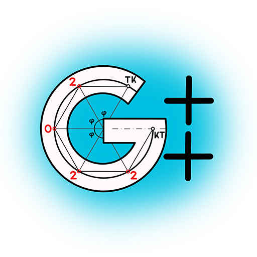
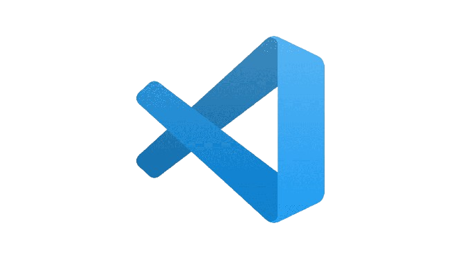
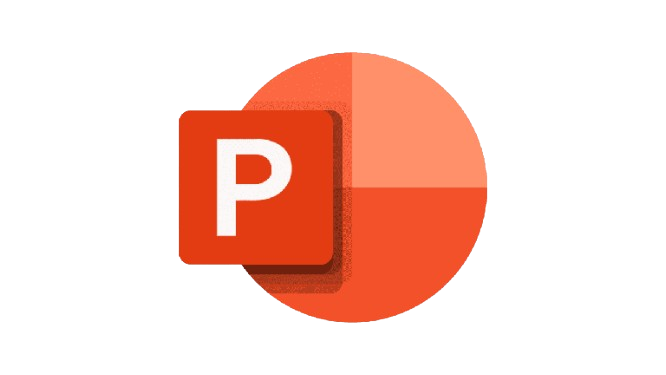

# ✨ LetterDash  
*A fast-paced Hangman-style word-guessing game with difficulty modes and a timer.*

---

## 📌 Overview  
LetterDash is a console-based word-guessing challenge written in **C++**.  
Players must guess the hidden word before time runs out or they exceed the maximum number of wrong attempts.

The game supports:  
- **Single Player Mode**  
- **Multiplayer (secret masked word input)**  
- **Difficulty selection**  
- **Real-time 30-second timer**  
- **ASCII hangman visuals**

🔗 **GitHub Repository:**  
https://github.com/codingburgas/sprint-math-games-9th-grade-letterdash.git

---

## 👥 Team Members

| Role | Name | GitHub |
|------|------|--------|
| ⭐ **Scrum Trainer** | ** | *(GitHub link)* |
| 🎨 **Frontend Developer** | *Member 2* | *(GitHub link)* |
| 🛠 **Backend Developer** | *Member 3* | *(GitHub link)* |
| 🧪 **Developer / QA** | *Member 4* | *(GitHub link)* |

> Replace placeholder names and links with your team information.

---

## 🧰 Used Technologies  
*(Add your images in the placeholders below — for example: ``)*

### 🖥️ Development Tools  
- **g++ Compiler (MinGW)**  
&nbsp;&nbsp;&nbsp;&nbsp;&nbsp;&nbsp;

- **Visual Studio 2022**  
 &nbsp;&nbsp;&nbsp;&nbsp; &nbsp;&nbsp;&nbsp;
  
- **Visual Studio Code**  

- **Git**  
&nbsp;&nbsp;&nbsp;&nbsp;&nbsp;&nbsp;&nbsp;&nbsp;
- **GitHub**  
&nbsp;&nbsp;&nbsp;

### 📚 Productivity & Communication  
- **Microsoft Teams**  
      

- **Microsoft Word**  
  

- **Microsoft PowerPoint**  
  

---

## 📥 Installation Guide

### ✔ Requirements  
- Windows OS (WinAPI required)
- **g++** (MinGW recommended)
- **Visual Studio 2022** or **VS Code**
- Git

---

### 🔧 1. Clone the Repository  

```sh
git clone https://github.com/codingburgas/sprint-math-games-9th-grade-letterdash.git
cd sprint-math-games-9th-grade-letterdash
cd LetterDash
g++ main.cpp -o main
main
